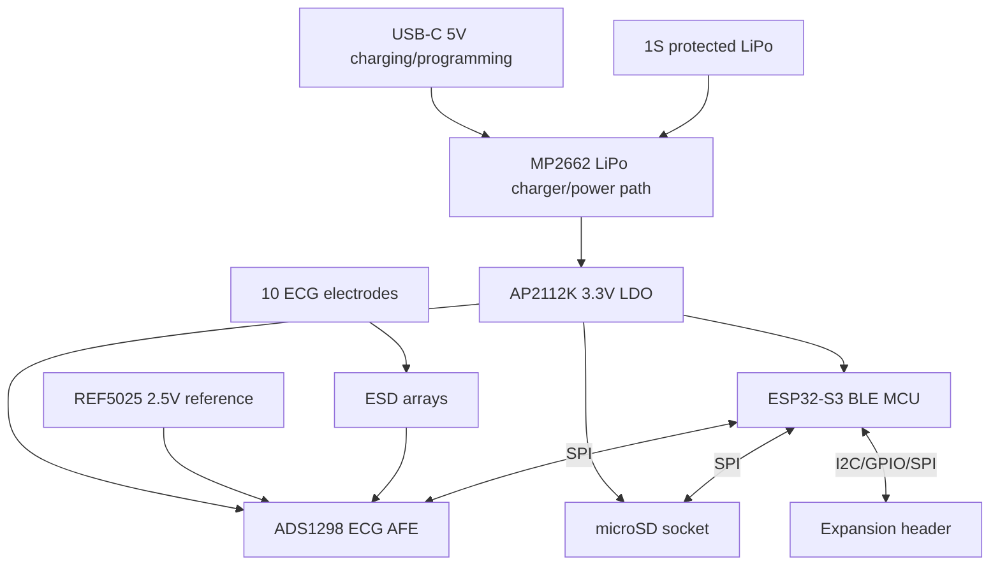

# Project Specification — Wearable 8-Channel ECG Acquisition Board

> **Source:** flux.ai project specification for **CardioCore V1**
> (board: *"wearable 8-channel ECG acquisition board"*). Captured 2026-06-30.
> This is the design-intent spec; where it disagrees with the live flux.ai
> project, the project files in [`flux_project/`](./flux_project/) win.

> **Research / education use only.** CardioCore V1 is a research, prototyping, and
> educational platform. It is **not** a certified medical device and is not intended
> for diagnosis, treatment, patient monitoring, emergency use, or any clinical
> decision-making. No regulatory conformance (FDA / CE / ISO) is claimed.

## Project Overview
Draft research-use wearable ECG acquisition board under 60 × 60 mm using ESP32-S3 and ADS1298.

## Intended Use
Research/prototyping only. Battery-powered wearable ECG capture with BLE streaming and microSD logging. Not designed or documented as a certified medical device.

## Main Features
- ESP32-S3-WROOM-1-N16R8 wireless MCU with BLE and native USB programming.
- TI ADS1298 8-channel 24-bit ECG AFE.
- Single-cell LiPo battery input with USB-C charging only; no patient connection while powered from USB is assumed for research safety workflow.
- microSD SPI logging.
- 10-electrode FFC/FPC connector: RA, LA, LL, RL/RLD, V1–V6.
- Low-capacitance ESD arrays at electrode connector.
- Expansion header with 3V3, GND, SPI, I2C, GPIO, and spare ADS1298 channel pins.

## System Architecture

## Power Tree and Power Budget
| Rail | Loads | Estimated typical | Estimated peak |
|---|---|---:|---:|
| VSYS/VBAT | Charger system output feeding 3.3 V LDO | ~120–180 mA | ~350–500 mA ESP32 transient |
| 3V3 | ESP32-S3, microSD, ADS1298 DVDD/AVDD, REF5025, pull-ups | ~120–180 mA | ~350–500 mA |

AP2112K 600 mA LDO is acceptable for first prototype, but ESP32 RF peaks require tight local bulk capacitance and runtime validation. For maximum battery runtime, a low-noise buck plus analog post-LDO can be considered later.

## Important Design Decisions
- ESP32-S3 module chosen to avoid discrete RF design risk and support BLE plus native USB.
- ADS1298 chosen for 8-channel ECG AFE with SPI control.
- External REF5025 2.5 V reference added for low-noise ADC reference.
- Electrode ESD uses low-capacitance PESD arrays at connector.
- Expansion header is a 2×20 2.54 mm library part because a compact exact 20-pin header was not available; only needed pins are assigned initially.

## Layout Requirements
- Target board: ≤60 × 60 mm.
- Use 4-layer stackup preferred: top signal/components, solid GND, power/quiet analog routing, bottom signal.
- Place electrode connector and ESD at one edge; ADS1298 immediately behind ESD/filter network.
- Keep ESP32 antenna at board edge with full antenna keepout on all layers.
- Keep analog input traces short, symmetric, guarded where appropriate, and isolated from SPI/USB/SD activity.
- Star/quiet return strategy around ADS1298; do not split ground under digital interfaces.

## Assumptions / Open Engineering Items
- Research use only, not patient-connected during USB charging/programming.
- Input protection/filter values are placeholders and must be finalized against ADS1298 datasheet, leakage/noise requirements, and the intended electrode cable.
- MP2662 charger configuration and NTC resistor need datasheet verification before production.
- Battery capacity/runtime and charging current target are not specified yet.
- ECG expansion connector pinout may be refined after the additional-channel module architecture is defined.

---

*See also: [`../../docs/Blockers_Before_PCB_Layout.md`](../../docs/Blockers_Before_PCB_Layout.md),
[`../../docs/CardioCore_Architecture_v1.md`](../../docs/CardioCore_Architecture_v1.md),
[`../../docs/ADS1298_Analog_Frontend_Notes.md`](../../docs/ADS1298_Analog_Frontend_Notes.md), and the BOM in [`bom/preliminary_bom.md`](./bom/preliminary_bom.md).*
